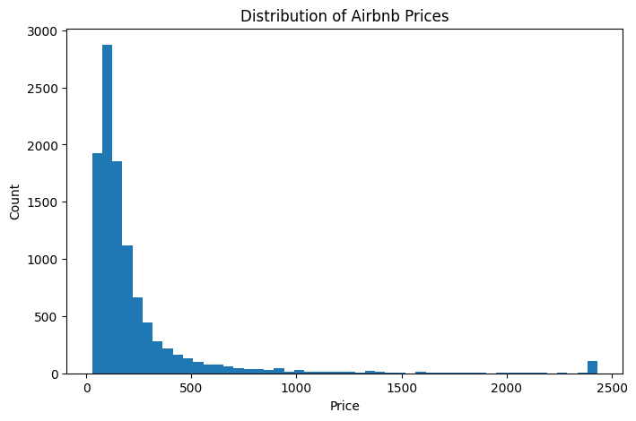
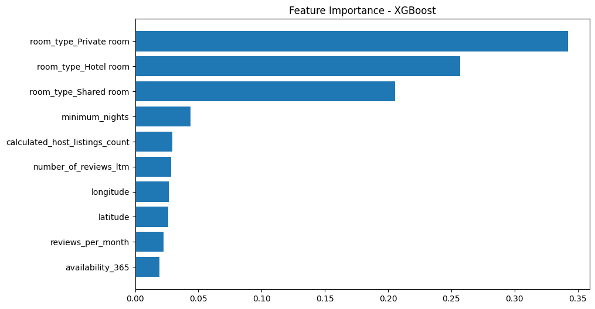

# Airbnb Texas Price Prediction

End-to-end data science project analyzing Airbnb listings in Texas and building machine learning models to predict nightly prices.

## Objective
Build a predictive model that estimates Airbnb nightly price using listing characteristics, host behavior, reviews, and availability data.

## Dataset
- ~10k listings  
- ~3.8M calendar records  
- ~580k reviews  
- Geospatial neighborhood boundaries  

## Project Workflow
1. Data Cleaning & Validation  
2. Exploratory Data Analysis (EDA)  
3. Feature Engineering  
4. Baseline Modeling (Linear Regression)  
5. Advanced Modeling (XGBoost)  
6. Model Evaluation  
7. Business Insights

## Models

| Model | RMSE | R² |
|-----|-----|----|
| Linear Regression | 0.44 | 0.24 |
| XGBoost | 0.23 | 0.61 |

XGBoost significantly outperforms the baseline.

## Key Features Driving Price
- Room Type  
- Minimum Nights  
- Reviews Per Month  
- Host Listing Count  
- Latitude & Longitude  
- Availability

## Sample Visuals

### Price Distribution


### Feature Importance (XGBoost)


## Business Insights
- Entire homes command large price premiums  
- High minimum-night requirements increase price  
- High-review velocity correlates with stronger demand  
- Location remains a major driver of value  

## Recommendations
- Hosts can optimize price by reducing minimum-night friction  
- New hosts should focus on early reviews  
- Investors should prioritize entire-home inventory in high-demand areas

## How to Run
```bash
pip install -r requirements.txt
jupyter notebook notebooks/airbnb-texas.ipynb
